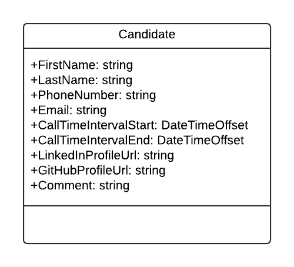
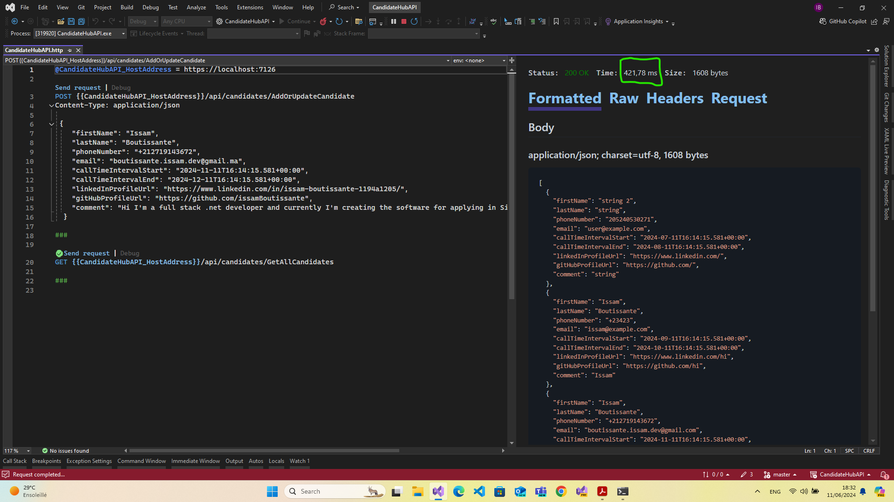
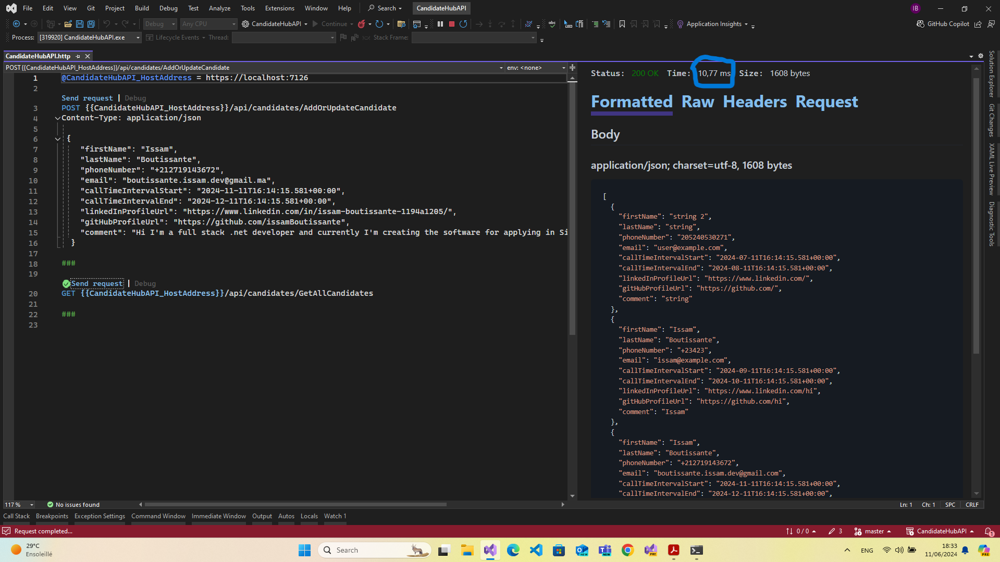
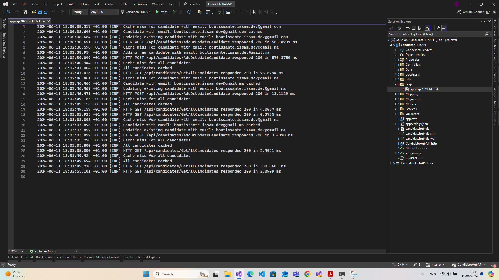
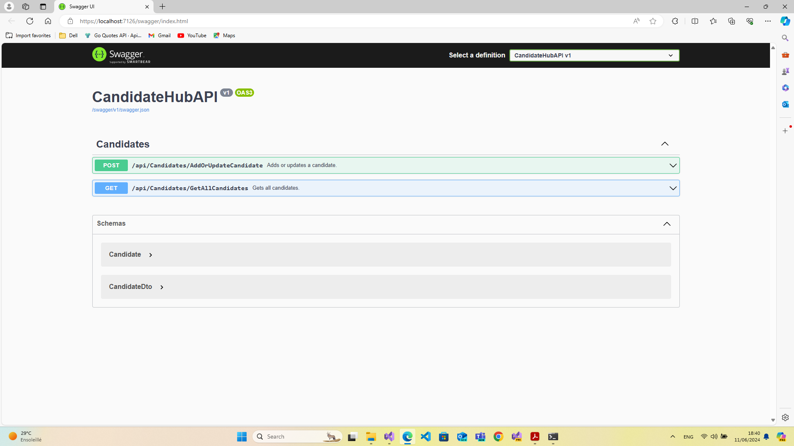
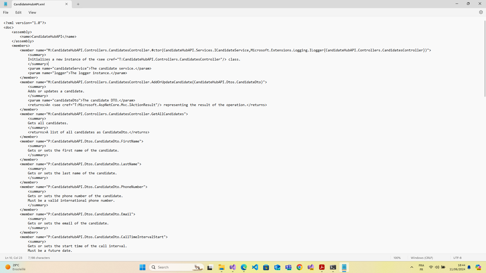

# CandidateHubAPI

## Project Overview

CandidateHubAPI is an ASP.NET Core Web API project designed to manage candidate information, including adding, updating, and retrieving candidate details. The project leverages .NET 8, Entity Framework Core, SQLite for database management, in-memory caching for improved performance, and Serilog for logging.

## Project Setup

### Step 1: Create the Visual Studio Project

- **Tools Used:** Visual Studio 2022 Version 17.10.0
- **Template:** ASP.NET Core Web API
- **Framework:** .NET 8

### Step 2: Design the Class Diagram

- **Tool Used:** Lucidchart
- **Description:** Designed a class diagram to represent the models for candidate information and the repository pattern.
- **Diagram:** 
- **Lucidchart Link:** [Lucidchart Class Diagram](https://lucid.app/lucidchart/aca452f5-793d-4933-a652-8e39b367d898/edit?viewport_loc=-233%2C-11%2C1867%2C1031%2C0_0&invitationId=inv_18e3aa9e-16fb-4e51-b13c-615f33cbfb6e)

### Step 3: Define the Models

- **Description:** Defined models based on the class diagram. Models include candidate information and other related entities.

### Step 4: Implement Data Access Layer

- **Entity Framework Core:** Set up Entity Framework Core with SQLite for easy testing. This can be extended to use SQL Server or other databases.
- **DbContext and Repository Classes:** Created DbContext and repository classes to manage database operations.

### Step 5: Create Service Layer

- **Description:** Implemented services to handle business logic.
- **Models:** Created models using Entity Framework.
- **Database:** Used SQLite for simplicity and easy testing, with potential to switch to other databases if needed.

### Step 6: Implement Controllers and Endpoints

- Implemented an endpoint for adding or updating candidate information.
- Implemented an endpoint to retrieve all candidate information.

### Step 7: Unit Tests

- **Description:** Implemented unit tests for all cases, including business logic and controllers.
- **Tools Used:** xUnit and Moq

### Step 8: Implement Caching

- **Description:** Implemented in-memory caching to improve performance for frequently accessed data.
- **Performance Test:**
  - **First-time Data Retrieval:**  - Took 421 ms
  - **Cached Data Retrieval:**  - Took 10 ms

### Step 9: Implement Logging

- **Logging:** Used Serilog for logging. Logs are stored in a file within the project directory.
- **Log File Location:** 

### Step 10: Documentation

- **Swagger:** Used Swagger for API documentation. Enabled XML documentation file generation.
- **Testing Tools:** Used HTTP file for performance comparison and testing.
- **Swagger Documentation Screenshot:** 
- **Generated XML Documentation:** 

## Features

1. **CRUD Operations:** API endpoints for adding, updating, and retrieving candidate information.
2. **Caching:** In-memory caching to enhance performance.
3. **Logging:** Serilog integration for file-based logging.
4. **Unit Testing:** Comprehensive unit tests for all business logic and controller methods.
5. **Documentation:** API documentation using Swagger.

## Project Structure

- **Controllers:** Contains API controllers.
- **Models:** Defines the data models.
- **Services:** Contains business logic services.
- **Data:** Includes DbContext and repository classes.
- **Tests:** Unit tests for services and controllers.

## How to Run

1. **Clone the Repository:**
   ```bash
   git clone https://github.com/issamBoutissante/CandidateHubAPI.git
   ```
2. **Open the Solution in Visual Studio:**

   - Navigate to the cloned directory and open the `CandidateHubAPI.sln` file in Visual Studio 2022.

3. **Ensure You Have the Correct Version of Visual Studio:**

   - Make sure you are using Visual Studio 2022 Version 17.10.0 ( The version may be diffrent but we still need Visual Studio 2022 ) to ensure compatibility.

4. **Build the Project:**

   - In Visual Studio, build the project by clicking on `Build > Build Solution`.

5. **Run the Project:**

   - Run the project by selecting the appropriate profile (`https`, `http`, or `IIS Express`) and clicking the run button (`F5`).

6. **Open in Browser:**

   - The project should automatically open in your default web browser. If not, navigate to:

     - Swagger UI: `https://localhost:7126/swagger/index.html` (this URL may vary based on the selected profile in Visual Studio).

   - **Note:** Migrations will be automatically applied when running the application.

7. **Open in Browser:**
   - Swagger UI: `https://localhost:7126/swagger/index.html` (or the URL specified in your Visual Studio launch profile)
   - API HTTP File: `CandidateHubAPI.http`

> **Note:** The Swagger UI URL may change based on the profile chosen inside Visual Studio.

## Future Enhancements

- **Logging:** Consider using more advanced logging solutions, such as logging to cloud services (e.g., Azure Application Insights, AWS CloudWatch) for better scalability and monitoring.
- **Exception Handling:** Implement a global exception handling mechanism to capture and log all exceptions.
- **Database:** Switch to a production-ready database such as SQL Server or PostgreSQL.

## Conclusion

This project provides a robust and scalable solution for managing candidate information, with a focus on performance, maintainability, and extensibility. The implementation includes comprehensive documentation, logging, and testing to ensure the highest code quality and reliability.

## Next Steps and Feedback

> **Note:**
>
> I'm excited to receive your feedback on the CandidateHubAPI project. Please feel free to review the code, test the application, and share your thoughts. I'm looking forward to our next meeting.
>
> Thank you for your time and consideration!
>
> Best regards,
> Issam Boutissante 😊
